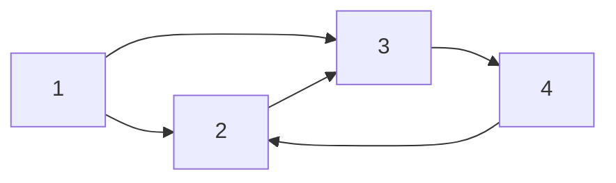
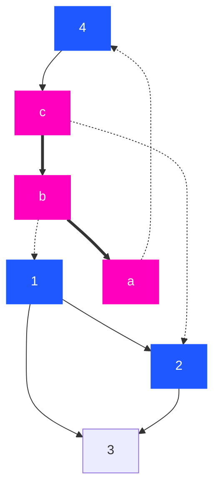
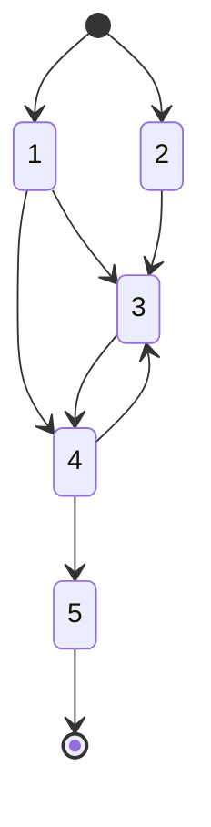
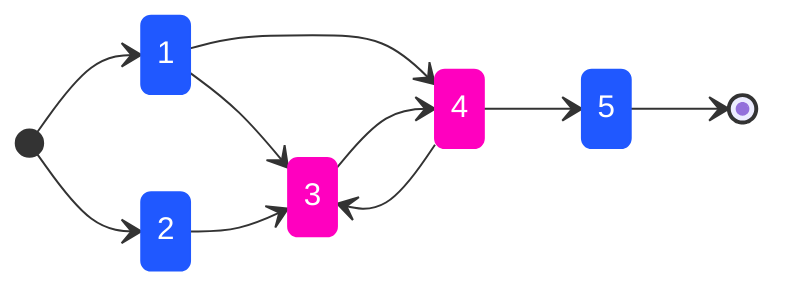

<a href="https://github.com/encalmo/graphs"></a> <a href="https://central.sonatype.com/artifact/org.encalmo/graphs_3" target="_blank"></a> <a href="https://encalmo.github.io/graphs/scaladoc/org/encalmo/data.html" target="_blank"></a>

# graphs

Scala library for processing graphs.

## Dependencies

   - JVM >= 21
   - [Scala](https://www.scala-lang.org) >= 3.7.4

## Usage

Use with SBT

    libraryDependencies += "org.encalmo" %% "graphs" % "0.11.0"

or with SCALA-CLI

    //> using dep org.encalmo::graphs:0.11.0

## Table of contents

- [Dependencies](#dependencies)
- [Usage](#usage)
- [Motivation](#motivation)
- [Supported Graph Algorithms](#supported-graph-algorithms)
- [Creating a Graph](#creating-a-graph)
   - [Weighted Graphs](#weighted-graphs)
   - [Loading Graphs from Files](#loading-graphs-from-files)
   - [Mutating a Graph](#mutating-a-graph)
- [Computing Properties of a Graph](#computing-properties-of-a-graph)
   - [Nodes and Edges](#nodes-and-edges)
   - [Adjacency and Neighbors](#adjacency-and-neighbors)
   - [Roots and Leaves](#roots-and-leaves)
   - [Predecessors and Ancestors](#predecessors-and-ancestors)
   - [Traversal: BFS and DFS](#traversal:-bfs-and-dfs)
   - [Cycle Detection](#cycle-detection)
   - [Topological Sorting](#topological-sorting)
   - [Strongly Connected Components (SCCs)](#strongly-connected-components-(sccs))
   - [Shortest Paths (Dijkstra)](#shortest-paths-(dijkstra))
- [Mermaid diagrams](#mermaid-diagrams)
      - [Simple graph diagram](#simple-graph-diagram)
      - [Graph diagram with clases and edge types](#graph-diagram-with-clases-and-edge-types)
      - [Simple state diagram](#simple-state-diagram)
      - [State diagram with classes](#state-diagram-with-classes)
- [Project content](#project-content)

## Motivation

Graph algorithms (traversals, shortest paths, strongly connected components, min-cut, etc.) show up in many domains—dependency resolution, scheduling, network analysis, puzzles. This library provides a small, dependency-light, idiomatic Scala API for building and querying directed and undirected graphs, with built-in support for common algorithms and for loading graphs from standard formats (edge lists, adjacency lists). Use it when you need graph processing without pulling in a heavy framework.

## Supported Graph Algorithms

The library implements several essential graph algorithms out of the box. These include:

- **Depth-First Search (DFS)**: Traverse nodes in depth-first order with support for pre/post visit hooks.
- **Breadth-First Search (BFS)**: Traverse nodes layer-by-layer from a starting node.
- **Topological Sort**: Returns a linear ordering of nodes for Directed Acyclic Graphs (DAGs).
- **Cycle Detection**: Check for cycles and obtain all nodes involved in cycles.
- **Strongly Connected Components (SCC)**: Computes all strongly connected components using Kosaraju's algorithm.
- **Shortest Paths (Weighted, Dijkstra)**: Find shortest paths and distances between nodes in graphs with integer edge weights (Dijkstra’s algorithm).
- **Min-Cut (Karger's Algorithm)**: Estimates the minimum cut of an undirected graph.
- **Graph Reversal**: Obtain a reversed version of a directed graph.

## Creating a Graph

You can create graphs using the `Graph` companion object's `apply` methods. These support both unweighted (default) and weighted graphs, with intuitive syntax.

A directed graph can be built by specifying each node and the sequence of its outgoing neighbors as key-value pairs:

```scala
import org.encalmo.data.Graph

val g = Graph[Int](
  1 -> Seq(2, 3),
  2 -> Seq(3),
  3 -> Seq(4),
  4 -> Seq()
)
```

This creates a graph with edges 1→2, 1→3, 2→3, and 3→4.

### Weighted Graphs

For weighted graphs, provide pairs (neighbor, weight) for each outgoing edge:

```scala
val weighted = Graph[Int, Int](
  1 -> Seq((2, 5), (3, 1)), // Edges: 1→2 (weight 5), 1→3 (weight 1)
  2 -> Seq((3, 4)),
  3 -> Seq()
)
```

Here, the first type parameter is the node type, the second is the weight type.

### Loading Graphs from Files

You can also construct graphs from files in standard formats (e.g., edge lists or adjacency lists):

```scala
val graphFromEdgeList = Graph.readFromEdgeListFile(Source.fromFile("edges.txt"))
val graphFromAdjacencyList = Graph.readFromAdjacentListFile(Source.fromFile("adjlist.txt"))

// For weighted adjacency list:
val weightedGraph = Graph.readFromAdjacentWeightListFile(Source.fromFile("weighted_adjlist.txt"))
```

### Mutating a Graph

By default, the `Graph` API creates immutable graph instances. To perform mutations (add/remove nodes or edges), you can convert the immutable graph to a mutable version using `.mutableCopy`. All the following operations are supported on mutable graphs:

```scala
import org.encalmo.data.Graph

// Create an immutable graph
val g = Graph[Int](
  1 -> Seq(2, 3),
  2 -> Seq(3),
  3 -> Seq()
)

// Get a mutable copy
val mutableGraph = g.mutableCopy

// Add a node
mutableGraph.addNode(4)

// Add an edge from node 3 to node 4
mutableGraph.addEdge(3, 4)

// Remove an edge from node 2 to node 3
mutableGraph.removeEdge(2, 3)

// Remove a node (and all its incident edges)
mutableGraph.removeNode(1)
```

After mutating, you can continue to use the mutable graph, or freeze it back to an immutable instance with `.freeze`:

```scala
val immutableAgain = mutableGraph.freeze
```

**Note:** Mutating shared immutable graphs will not alter the original graph. Mutations only affect the mutable copy.

## Computing Properties of a Graph

The `Graph` API provides various methods to compute important properties and perform common graph algorithms:

### Nodes and Edges

Basic properties to introspect the structure of any graph:

```scala
val g = Graph(1 -> Seq(2, 3), 2 -> Seq(3), 3 -> Seq())
// Number of nodes
val nodeCount = g.nodesCount                 // Int
val nodeSet = g.nodes                        // collection.Set[N]
// Number of edges
val edgeCount = g.edges.size                 // Int
val edgeList = g.edges                       // Iterable[(N, N)]
// Check existence
val hasNode = g.containsNode(2)              // Boolean
val hasEdge = g.containsEdge(1, 3)           // Boolean
```

### Adjacency and Neighbors

Query neighboring nodes and edge weights:

```scala
val neighbors = g.adjacent(1)                  // Iterable[N]
val weight = weightedGraph.weight(1, 3)        // Edge weight between 1 and 3
```

### Roots and Leaves

You can easily obtain the roots (nodes with no predecessors, i.e., no incoming edges) and leaves (nodes with no outgoing edges) of a graph. These are helpful, for example, to identify entry points or terminal nodes in dependency graphs and workflows:

```scala
val g = Graph(1 -> Seq(2, 3), 2 -> Seq(3), 3 -> Seq())
// Find root nodes (no incoming edges)
val roots = Graph.rootsOf(g)      // Returns Set(1)

// Find leaf nodes (no outgoing edges)
val leaves = Graph.leavesOf(g)    // Returns Set(3)
```

- In the example above, node 1 is a root because it has no incoming edges.
- Node 3 is a leaf because it has no outgoing edges.

### Predecessors and Ancestors

You can compute the predecessors (nodes with edges into a given node) and ancestors (all nodes from which you can reach a given node via a path) of a node:

```scala
val preds = g.predecessors(3)      // Returns a Set[N] of immediate predecessors of node 3
val ancestors = g.ancestors(3)     // Returns a Set[N] of all reachable ancestors of node 3
```

For example, with:

```scala
val g = Graph(1 -> Seq(2, 3), 2 -> Seq(3), 3 -> Seq())
```

- `g.predecessors(3)` yields `Set(1, 2)`, since nodes 1 and 2 both have an edge to 3.
- `g.ancestors(3)` yields `Set(1, 2)`, as both can reach 3 via a path.

These are useful for dependency analysis, reachability, and more.

### Traversal: BFS and DFS

Traverse graphs with breadth-first or depth-first strategies:

```scala
// Depth-first search (DFS) visiting every node:
Graph.dfs(g)(new Graph.DfsVisitor[Int] {
  override def before(node: Int) = println(s"DFS visits $node")
})

// Breadth-first search (BFS):
Graph.bfs(g) { node => println(s"BFS visits $node") }
```

### Cycle Detection

Detect cycles and retrieve cyclic nodes:

```scala
val hasCycles = Graph.hasCycles(g2)          // returns true/false
val cycles = Graph.findCycles(g2)            // Returns Vector[N] of nodes in cycles
```

### Topological Sorting

For directed acyclic graphs (DAGs), you can obtain a valid topological ordering:

```scala
val order = Graph.sortTopologically(g3)      // Returns List[N], in topological order
```

### Strongly Connected Components (SCCs)

Identify SCCs in directed graphs:

```scala
val sccs = Graph.findStronglyConnectedComponents(g2) // Vector[Set[N]]
```

### Shortest Paths (Dijkstra)

For weighted graphs (with positive weights), compute shortest paths:

```scala
val (distance, path) = weightedGraph.findShortestPath(1, 5)
// distance: lowest total weight Int
// path: List[(N, N)] representing the sequence of edges

val allDistances = weightedGraph.findShortestPaths(1)
// allDistances: Map[N, Int]
```

## Mermaid diagrams

The library provides utilities for rendering graphs in [Mermaid](https://mermaid-js.github.io/) syntax for easy visualization in Markdown files, documentation, and compatible tools.

#### Simple graph diagram

You can generate a Mermaid representation of a `Graph` using the `Mermaid.render` method:

```scala
val g = Graph(1 -> Seq(2, 3), 2 -> Seq(3), 3 -> Seq(4), 4 -> Seq(2))
val mermaid =
  Mermaid.renderGraph(g, Mermaid.Direction.LeftToRight)

println(mermaid)
```

This prints:



#### Graph diagram with clases and edge types

You can further customize node styles and edge types using an extended version of `Mermaid.render`:

```scala
type Node = Int | String
val g = Graph[Node](
  1   -> Seq(2, 3),
  2   -> Seq(3),
  4   -> Seq("c"),
  "a" -> Seq(4),
  "b" -> Seq(1, "a"),
  "c" -> Seq("b", 2)
)
val mermaid = Mermaid.renderGraph(
  g,
  classDef = {
    case "int"    => "fill:#2058FF,stroke:#2058FF,color:#fff"
    case "string" => "fill:#FF00BF,stroke:#FF00BF,color:#fff"
  },
  nodeClass = {
    case n: Int    => "int"
    case n: String => "string"
  },
  edgeType = {
    case (_: Int, _: Int)       => "-->"
    case (_: String, _: String) => "==>"
    case (_: Int, _: String)    => "-->"
    case (_: String, _: Int)    => "-.->"
  },
  direction = Mermaid.Direction.TopToBottom
)

println(mermaid)
```

Example output:



#### Simple state diagram

The `Mermaid` utility also supports rendering [state diagrams](https://mermaid.js.org/syntax/stateDiagram.html) in Mermaid syntax using its `renderStateDiagramV2` methods.

You can render a simple state diagram by providing a directed graph, starts and ends will be derived from graph's rootes and leaves:

```scala
val g = Graph[Int](
  1 -> Seq(3, 4),
  2 -> Seq(3),
  3 -> Seq(4),
  4 -> Seq(3, 5),
  5 -> Seq()
)
val mermaid = Mermaid.renderStateDiagramV2(g)
println(mermaid)
```

**Output:**



#### State diagram with classes

You can render a state diagram with custom start/end nodes and style classes. For example:

```scala
val graph = Graph[Int](
  1 -> Seq(3, 4),
  2 -> Seq(3),
  3 -> Seq(4),
  4 -> Seq(3, 5),
  5 -> Seq()
)
val mermaid = Mermaid.renderStateDiagramV2(
  graph,
  starts = Seq(1, 2),
  ends = Seq(5),
  classDefs = Map(
    "foo" -> "fill:#2058FF,stroke:#2058FF,color:#fff",
    "bar" -> "fill:#FF00BF,stroke:#FF00BF,color:#fff"
  ),
  nodeClass = {
    case 1 | 2 | 5 => "foo"
    case 3 | 4     => "bar"
  },
  direction = Mermaid.Direction.LeftToRight
)
println(mermaid)
```

**Output:**




## Project content

```
├── .github
│   └── workflows
│       ├── pages.yaml
│       ├── release.yaml
│       └── test.yaml
│
├── .gitignore
├── .scalafmt.conf
├── Graph.scala
├── Graph.test.scala
├── Heap.scala
├── Heap.test.scala
├── IntTraversable.scala
├── LICENSE
├── Mermaid.scala
├── Mermaid.test.scala
├── project.scala
├── QuickSort.scala
├── README.md
├── test-resources
│   ├── dijkstraData.txt
│   ├── graph1.txt
│   ├── HashInt.txt
│   ├── inversions.txt
│   ├── Median.txt
│   ├── quicksort.txt
│   └── SCC.txt
│
├── test.sh
├── Traversable.scala
└── Traversable.test.scala
```

